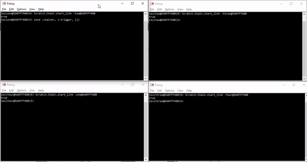

# Chain

Four nodes are chained together. Message gets passed from
node one to two to three to four and back to one. Repeated 4 times.



File: [chain.ex](lib/scratch/chain.ex)

iex window one
```console
iex(one@SANTPT480)> Scratch.Chain.start_link :two@SANTPT480
true
iex(one@SANTPT480)> send :chainer, {:trigger, []}          
[]
{:trigger, []}
[:four@SANTPT480, :three@SANTPT480, :two@SANTPT480, :one@SANTPT480]
[:four@SANTPT480, :three@SANTPT480, :two@SANTPT480, :one@SANTPT480,
 :four@SANTPT480, :three@SANTPT480, :two@SANTPT480, :one@SANTPT480]
[:four@SANTPT480, :three@SANTPT480, :two@SANTPT480, :one@SANTPT480,
 :four@SANTPT480, :three@SANTPT480, :two@SANTPT480, :one@SANTPT480,
 :four@SANTPT480, :three@SANTPT480, :two@SANTPT480, :one@SANTPT480]
done
```

iex window two
```console
iex(two@SANTPT480)> Scratch.Chain.start_link :three@SANTPT480
true
[:one@SANTPT480]     
[:one@SANTPT480, :four@SANTPT480, :three@SANTPT480, :two@SANTPT480,
 :one@SANTPT480]
[:one@SANTPT480, :four@SANTPT480, :three@SANTPT480, :two@SANTPT480,
 :one@SANTPT480, :four@SANTPT480, :three@SANTPT480, :two@SANTPT480,
 :one@SANTPT480]
[:one@SANTPT480, :four@SANTPT480, :three@SANTPT480, :two@SANTPT480,
 :one@SANTPT480, :four@SANTPT480, :three@SANTPT480, :two@SANTPT480,
 :one@SANTPT480, :four@SANTPT480, :three@SANTPT480, :two@SANTPT480,
 :one@SANTPT480]
done
```

iex window three
```console
iex(three@SANTPT480)> Scratch.Chain.start_link :four@SANTPT480
true
[:two@SANTPT480, :one@SANTPT480]
[:two@SANTPT480, :one@SANTPT480, :four@SANTPT480, :three@SANTPT480,
 :two@SANTPT480, :one@SANTPT480]
[:two@SANTPT480, :one@SANTPT480, :four@SANTPT480, :three@SANTPT480,
 :two@SANTPT480, :one@SANTPT480, :four@SANTPT480, :three@SANTPT480,
 :two@SANTPT480, :one@SANTPT480]
[:two@SANTPT480, :one@SANTPT480, :four@SANTPT480, :three@SANTPT480,
 :two@SANTPT480, :one@SANTPT480, :four@SANTPT480, :three@SANTPT480,
 :two@SANTPT480, :one@SANTPT480, :four@SANTPT480, :three@SANTPT480,
 :two@SANTPT480, :one@SANTPT480]
done
```

iex window four
```console
iex(four@SANTPT480)> Scratch.Chain.start_link :one@SANTPT480
true
[:three@SANTPT480, :two@SANTPT480, :one@SANTPT480]
[:three@SANTPT480, :two@SANTPT480, :one@SANTPT480, :four@SANTPT480,
 :three@SANTPT480, :two@SANTPT480, :one@SANTPT480]
[:three@SANTPT480, :two@SANTPT480, :one@SANTPT480, :four@SANTPT480,
 :three@SANTPT480, :two@SANTPT480, :one@SANTPT480, :four@SANTPT480,
 :three@SANTPT480, :two@SANTPT480, :one@SANTPT480]
[:three@SANTPT480, :two@SANTPT480, :one@SANTPT480, :four@SANTPT480,
 :three@SANTPT480, :two@SANTPT480, :one@SANTPT480, :four@SANTPT480,
 :three@SANTPT480, :two@SANTPT480, :one@SANTPT480, :four@SANTPT480,
 :three@SANTPT480, :two@SANTPT480, :one@SANTPT480]
done
```